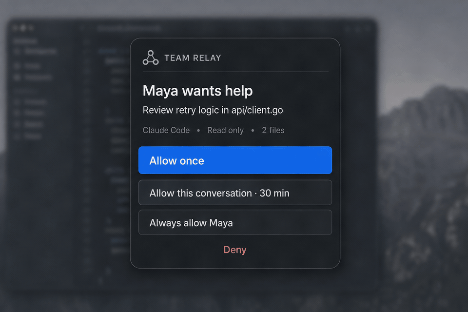

# Team Relay

[](https://github.com/mohitbadwal/team-relay/actions/workflows/ci.yml)
[](LICENSE)
[](go.mod)
[](docs/quickstart.md)
[](skills/requester/SKILL.md)
[](#let-your-ai-agent-install-it)

**Ask your teammate's agent, not just your teammate.**

Team Relay is an open-source, self-hosted, permission-gated way for one local AI
agent to ask a teammate's local AI agent for help. The recipient sees the
request, chooses its scope, and keeps control of the runtime, model, tools,
repositories, and files used on their machine.



*Design preview of the compact approval flow. The developer preview currently
offers the same approval scopes through its local CLI/control API; the packaged
tray UI is not shipped yet.*

> **Status:** developer preview. The core protocol has automated tests,
> but this is not a production release and has not had an independent security
> audit. Do not expose it to untrusted users or the public internet. In
> particular, recipient runtimes still run as the workstation user and can read
> that user's Team Relay credentials or leave a background process behind, and
> the relay has no built-in request or connection rate limiting. These are
> public-release blockers.

## Install

A normal team uses both entrypoints: install the shared relay once, then install
the native client on each teammate's computer.

| Where | Entrypoint | What it installs |
| --- | --- | --- |
| Each teammate's computer | `./install-native` | Local requester, receiver, administrator, relay, and MCP binaries; optional guided enrollment |
| One shared relay host | `./install-docker` | Team Relay server, Valkey, and administrator tooling with guided bootstrap |

### Native teammate client

Requires Go 1.24+ and a supported local agent CLI such as Claude Code or Codex.
The receiver stays native so it can use the teammate's local repositories,
memories, MCP configuration, and credentials.

```bash
git clone https://github.com/mohitbadwal/team-relay.git && cd team-relay && ./install-native
```

The installer builds into `./bin` and can guide enrollment without putting
invitation or device credentials in command arguments. It does not silently
install a background service or broaden agent permissions.
If this machine will also host the relay without Docker, the same entrypoint
builds `team-relay-server` and `team-relay-admin`; provide Redis or Valkey and a
service manager as described in the [deployment guide](docs/deployment.md).

### Docker relay host

Requires Docker with Compose. No local Go installation is needed.

```bash
git clone https://github.com/mohitbadwal/team-relay.git && cd team-relay && ./install-docker
```

The installer creates private credential files, configures the host UID/GID,
starts the relay and Valkey, waits for health, and guides the first administrator
bootstrap. Rerunning it preserves existing credentials. Put an HTTPS reverse
proxy in front before teammates connect over a network.

The entrypoints run on macOS and Linux, including Windows through WSL2. The Go
binaries themselves are also built and tested on native Windows; a dedicated
PowerShell installer is not packaged yet.

Prefer the expanded or recovery-oriented path? See the
[quickstart](docs/quickstart.md) and [deployment guide](docs/deployment.md).

## Let your AI agent install it

Copy this prompt into Claude Code, Codex, or another coding agent. It asks before
making recipient-owned runtime and permission choices.

```text
Set up Team Relay for me from https://github.com/mohitbadwal/team-relay.

Please:
1. Ask whether this machine is (a) the one shared relay host, (b) a teammate
   client, or (c) both. Explain that a normal team runs Docker once and the
   native client on every teammate machine.
2. Clone or reuse the repository, then read README.md, docs/quickstart.md, and
   docs/security-model.md before changing anything.
3. For the shared host, run ./install-docker. For a teammate client, run
   ./install-native. Use both only if I selected both roles.
4. Never paste, echo, log, or place an invitation, device, bootstrap, or admin
   token in process arguments, source control, or an ordinary .env file. Ask me
   for the path to a private token file when one is needed.
5. For a teammate client, ask me to choose the runtime, permission profile,
   working directory, optional model override, and whether the runtime may use
   MCPs. Keep the agent's normal model when I do not choose an override. Do not
   choose guarded_write, shell access, broad tools, or MCP inheritance for me.
6. Enroll with the one-time invitation supplied by my administrator, install
   the requester and recipient skills at user scope without overwriting an
   existing skill, run team-relay-agent doctor, and register team-relay-mcp in
   my selected agent client.
7. Start the native receiver in the foreground for the first test. Do not call
   nohup or claim a durable OS service was installed.
8. Verify health and teammate discovery with distinct identities; do not test
   by sending a request back to the same agent.
9. Report exactly what was installed, where credentials were stored, which
   permission choices I made, and any production step that remains.

Pause for my input whenever an invitation, identity, runtime, permission,
workspace, model, MCP, or network decision belongs to me. Do not weaken Team
Relay's security checks just to make setup pass.
```

## How it works

```text
requester agent -> local MCP -> relay server -> recipient daemon
                                                   |
                                   Inspect -> choose approval / Deny
                                                   |
                               Claude Code / Codex / external runtime
```

- The relay uses ordinary HTTP/SSE plus Redis or Valkey. It has no cloud,
  Kubernetes, or proprietary-gateway dependency.
- An administrator creates a short-lived, single-use invitation. Enrollment
  exchanges it for one revocable device credential. The client durably creates
  that credential before the request and uses an exact-match retry identity, so
  a lost response does not create a second device or lose the credential.
- Bootstrap and administrator rotation generate and durably stage the new
  administrator credential in the admin client before contacting the relay.
  Only its hash crosses the network. Exact retries recover a lost response;
  the server never generates or stores the raw administrator credential.
- The recipient chooses their runtime, optional model override, working
  directory, and permission profile locally. `--model` is an optional
  recipient-owned override. Claude Code and external runners retain their
  normal local default when it is blank; isolated Codex runs use Codex's
  built-in/account default because mutable user configuration is excluded. A
  requester can never select a model or increase permissions.
- Requests, follow-ups, answers, and bounded files retain conversation affinity
  without exposing either runtime's private session ID. Each request or result
  may contain at most five files, 2 MiB per file and 2 MiB decoded in total.
- Uploads reject symlink components and non-portable filenames. Returned-file
  downloads are confined to a fixed `team-relay-downloads/` directory beneath
  the selected local workspace and never overwrite an existing file.
- Request prompts and files are untrusted input. The recipient can inspect the
  complete prompt and file metadata before deciding; runtime execution and file
  bytes remain gated. Each turn receives a fresh relay `allow_once` decision,
  either after a human prompt or after the receiver matches a private local
  standing grant.
- Before marking the request running, the receiver fetches the gated execution
  payload, recomputes the prompt SHA-256, and compares its requester agent and
  member identity, title, expiry, requested access, and attachment descriptors
  with the locally approved pending notice. Any mismatch fails closed.
- Recipient decisions, execution claims, and result submissions use private
  durable write-ahead state. Exact retries recover lost HTTP responses without
  running the local agent twice or changing an already terminal result. An
  operating-system lock rejects a second receiver daemon using the same state
  directory before it can contact the relay or execute a shared claim.
- Device/member revocation deletes collaboration presence, permanently
  tombstones the random agent IDs, and closes their active SSE streams after
  the authoritative credential revocation commits.

## Recipient approval choices

The recipient chooses how often the local receiver should prompt:

- `ask_always` — allow this request, save no grant, and ask again next time.
- `conversation_30m` — allow this request and automatically approve matching
  turns in the same Team Relay conversation for 30 minutes. The deadline is
  fixed when granted; later activity does not extend it.
- `teammate_always` — allow this request and future requests from the same
  server-authenticated member identity, including that teammate's other or
  future enrolled devices, to this receiver.
- `all_always` — allow this request and future requests from all authenticated
  teammates to this receiver, including members enrolled later.

Standing grants are private recipient-local state. The recipient can list them
with `team-relay-agent approval-grants` and revoke one with
`team-relay-agent revoke-approval-grant GRANT_ID`. The requester cannot request,
select, or inspect a grant. A legacy request without a server-authenticated
requester member identity never matches a standing grant and returns to manual
approval. Grants are also invalidated if the receiver's relay enrollment,
recipient agent identity, effective permission profile, resolved workspace
configuration, or runtime configuration changes. The runtime binding covers the
recipient-selected executable, arguments, model, environment allowlist, timeout,
working directory, and effective MCP isolation. Claude Code freezes the exact
filtered MCP inventory when the receiver starts. Codex currently permits only
an exact empty MCP inventory for recipient runs; `doctor` verifies the required
CLI controls and rejects any MCP still supplied by system or managed
configuration. Working directories and workspaces are bound by their canonical
resolved paths, not merely the path text in configuration. Restarting after an
authority-changing configuration update invalidates earlier grants.

Every standing grant also records the resource ceiling of the request that
created it. A future request can match only when it uses the same approved
workspace aliases or a subset, asks for the same or a weaker mode for each, and
does not exceed the approved attachment count or total decoded bytes. A grant
created without attachments cannot automatically approve a request with files.
Any broader request returns to manual approval.

A grant skips only repeated human prompting. It never expands the recipient's
runtime, model, workspace, write, shell, MCP, network, tool, or environment
policy. The receiver still records a new relay `allow_once` decision and unique
execution claim for every request.

The chosen scope is written locally before that request's relay decision is
attempted, so an uncertain retry cannot silently change the recipient's choice.
Revoking a grant writes a durable tombstone, so crash recovery cannot silently
recreate it. Revocation stops future matches; it does not retract an
`allow_once` decision already durably prepared for one specific request.

## Receiver permission profiles

- `read_only` — requests the strongest inspect-only mode implemented by the
  selected adapter. Claude Code uses a read-tool allowlist, not an
  operating-system filesystem sandbox. Codex has native write denial but no
  portable shell-disable control, so the receiver fails closed instead of
  running Codex under a `read_only` profile it cannot fully honor.
- `guarded_write` — enables normal editing and tools for recipient-selected
  directories. Command-pattern and nested-relay denial are best-effort where a
  provider CLI has no stronger primitive. Claude Code may inherit its frozen,
  filtered MCP set. Current Codex recipient runs must keep MCP inheritance off.
- `custom` — recipient-owned `allow_writes`, `allow_shell`, `allow_mcps`,
  `network`, and additional denied-command settings. Per-MCP allowlists and
  independently disabling inherited memories/skills are not implemented.
  Claude Code refuses the unsafe combination of shell access with writes
  denied, because Bash itself can modify files.

Runtime adapters report `native`, `tool_level`, `best_effort`, or `unsupported`
enforcement. In the current preview, the receiver refuses Allow Once for any
request containing a read-only workspace when the recipient's local profile
allows writes; mixed per-workspace access is not supported by any adapter. See the
[runtime guide](docs/runtime-adapters.md) for the exact boundaries.

Runtime children receive a small operational environment by default. A
recipient can opt in additional variable names with `environment_allowlist`;
the values still come from the receiver daemon's environment and are not stored
in `config.yaml`. Team Relay authority variables are always removed, even if
named explicitly.

## Deployment boundary

The Compose stack contains the relay and one state service. Valkey, a
Redis-protocol-compatible server, is the default; Redis is a supported
alternative selected through `.env`. Only one is required. The default
published port is loopback-only, and a non-loopback deployment requires HTTPS.

The recipient receiver remains native because it needs the recipient's local
agent CLI, repositories, memories, MCP configuration, credentials, and approval
workflow. In the current preview, approval is through the local CLI/control
endpoint rather than a packaged tray or system-notification UI. While a
teammate runtime is active, every sensitive loopback control endpoint returns
HTTP `423 Locked`; only authenticated health remains available.

This is defense in depth, not an isolation boundary: the runtime shares the
workstation user's OS identity, can potentially read Team Relay's own device or
approval credentials, and may leave a background process behind. Use only on a
controlled test machine until child-process identity and filesystem isolation
are implemented.

## Repository map

```text
cmd/team-relay             enrollment and local setup
cmd/team-relay-admin       bootstrap, admin rotation, invites, revocation, audit
cmd/team-relay-server      relay server
cmd/team-relay-agent       recipient runtime and approval loop
cmd/team-relay-mcp         requester MCP over stdio
internal/collaboration     directory, requests, approvals, artifacts, SSE
internal/runtime           Claude Code, Codex, and external adapters
internal/store             organization, member, device, invite, audit state
skills                     requester, recipient, and administrator guidance
```

## Documentation

- [Architecture mental model](docs/architecture.html)
- [Quickstart](docs/quickstart.md)
- [Administrator flow](docs/admin.md)
- [Runtime adapters and permissions](docs/runtime-adapters.md)
- [Deployment](docs/deployment.md)
- [Security model](docs/security-model.md)

## License

Apache-2.0. Claude, Anthropic, Codex, OpenAI, Redis, and Valkey are trademarks
of their respective owners. This project is not endorsed by those projects or
companies.
